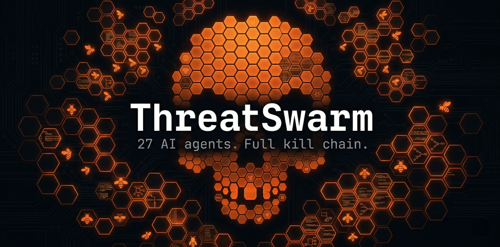

<div align="center">


<br>

<a href="https://github.com/mukul975/ThreatSwarm/stargazers"></a>
<a href="https://github.com/mukul975/ThreatSwarm/blob/main/LICENSE"></a>
<a href="#the-27-agents"></a>
<a href="https://claude.ai/claude-code"></a>
<a href="https://attack.mitre.org"></a>
<a href="https://github.com/mukul975/Anthropic-Cybersecurity-Skills"></a>

<br><br>

**27 scope-enforced AI agents that run the full pentest kill-chain (recon → exploit → post-ex → DFIR → report) as a one-command Claude Code plugin. Backed by 754 MITRE-mapped skills.**

</div>

---

> **For authorized security testing only.** Every network command is scope-gated by `scope_check.py` — violations are blocked deterministically at the OS level, not by convention or prompt instruction.

## Why ThreatSwarm

Most AI pentest tools stop at exploit. ThreatSwarm runs the complete kill chain — recon, exploitation, post-exploitation, DFIR, and a CVSS-scored report — in a single session. It ships as a one-command Claude Code plugin (no Docker, no Postgres, no cloud account required), enforces scope on every tool invocation across all 27 agents, and loads its methodology from the [754-skill Anthropic-Cybersecurity-Skills library](https://github.com/mukul975/Anthropic-Cybersecurity-Skills) mapped to ATT&CK, CSF 2.0, ATLAS, D3FEND, and AI RMF.

## Demo

```
$ claude --plugin-dir ./threatswarm-plugin

> /threatswarm:engage 10.10.10.5

  ✓  scope check  —  10.10.10.5 found in scope.txt

  →  recon agent starting...

[*] nmap -sS -T3 -p- 10.10.10.5
    22/tcp   open  ssh      OpenSSH 8.9p1
    80/tcp   open  http     Apache httpd 2.4.51
    8080/tcp open  http     Apache Tomcat 9.0.45
    3306/tcp open  mysql    MySQL 8.0.28

[*] nuclei -u http://10.10.10.5:8080 -severity critical,high
    [critical]  CVE-2021-44228  Log4Shell RCE         http://10.10.10.5:8080
    [high]      CVE-2020-1938   Tomcat AJP Ghostcat   http://10.10.10.5:8080

[*] feroxbuster -u http://10.10.10.5 -x php,txt
    200  /admin          Apache Tomcat Manager  [auth required]
    200  /api/v1/users   [JSON, 247 entries]
    200  /backup.zip     [3.2 MB]

  Attack vectors — prioritised:
  1  [CRITICAL]  Log4Shell RCE  →  /threatswarm:attack 10.10.10.5 exploit CVE-2021-44228
  2  [HIGH]      API user enum  →  /threatswarm:attack 10.10.10.5 api
  3  [HIGH]      Backup file    →  /threatswarm:attack 10.10.10.5 web

> /threatswarm:attack 10.10.10.5 exploit CVE-2021-44228

  →  exploit agent  [model: claude-opus-4-7]
  →  vuln-researcher confirming PoC reliability... weaponized ✓
  →  listener started on 10.10.14.1:4444
  →  payload delivered via X-Api-Version header
  [+] shell obtained  —  www-data@10.10.10.5

> /threatswarm:pwned 10.10.10.5

  →  post-ex agent
  [*] sudo -l  →  (ALL : ALL) NOPASSWD: /usr/bin/python3
  [+] privesc  →  root@10.10.10.5
  [*] /etc/shadow extracted  →  evidence/20260429/10.10.10.5/creds/shadow.hashes
  [*] crackmapexec smb 10.10.10.0/24  →  3 hosts reachable with root hash

> /threatswarm:report 10.10.10.5
  →  report-writer agent  →  reports/10.10.10.5_pentest.md  ✓
```

*Scope enforced throughout. Evidence written to `evidence/20260429/10.10.10.5/`.*

## Install

**Marketplace** (recommended — installs into any project):
```
/plugin marketplace add mukul975/ThreatSwarm
/plugin install threatswarm@threatswarm
```

**Standalone** — clone and use directly:
```bash
git clone https://github.com/mukul975/ThreatSwarm && cd ThreatSwarm
claude
```

**Single session** — load without installing:
```bash
git clone https://github.com/mukul975/ThreatSwarm
claude --plugin-dir ./ThreatSwarm/threatswarm-plugin
```

## Quickstart

1. Add authorized targets to `scope.txt`:
   ```
   10.10.10.5
   10.10.10.0/24
   example.com
   ```
2. Set your attacker IP in `.claude/settings.json` → `"LHOST": "10.10.14.1"`
3. Run `claude` and start a kill chain:
   ```
   /threatswarm:engage 10.10.10.5    # recon → ranked attack vectors
   /threatswarm:attack 10.10.10.5 web  # route to specialist agent
   /threatswarm:pwned 10.10.10.5     # post-shell: privesc → creds → lateral
   /threatswarm:hunt "C2 beaconing"  # ATT&CK-mapped threat hunt
   /threatswarm:ir ransomware        # DFIR triage
   /threatswarm:report engagement    # CVSS-scored PDF report
   ```

## The 27 Agents

| Agent | Domain | Key Tools |
|---|---|---|
| **— Offensive —** | | |
| `recon` | Port scan · service enum · subdomain discovery | nmap, nuclei, httpx, subfinder, amass |
| `exploit` | CVE exploitation · initial shell access | Metasploit, searchsploit, PoC analysis |
| `post-ex` | Privesc · lateral movement · persistence | linpeas, mimikatz, secretsdump |
| `web-attacker` | SQLi · XSS · SSRF · LFI · OWASP Top 10 | sqlmap, Burp Suite, ffuf, dalfox |
| `api-attacker` | REST · GraphQL · gRPC · BOLA · JWT attacks | RESTler, jwt_tool, arjun |
| `active-directory` | Kerberoast · DCSync · BloodHound · ADCS ESC1-8 | Impacket, BloodHound, certipy |
| `network-ops` | ARP spoof · MitM · SMB relay · packet capture | Responder, Bettercap, tshark |
| `osint` | Domain intel · email harvest · breach data | Shodan, theHarvester, SpiderFoot |
| `wireless-attacker` | WPA2/WPA3 · evil twin · PMKID · EAP capture | aircrack-ng, hostapd-wpe, hcxdumptool |
| `cloud-attacker` | AWS · Azure · GCP · IAM privesc · S3 abuse | Pacu, ScoutSuite, aws-cli |
| `container-attacker` | Docker escape · K8s RBAC · etcd · namespace breakout | Trivy, kube-hunter, kubectl |
| `mobile-attacker` | Android · iOS · APK decompile · Frida · SSL pin bypass | MobSF, Frida, jadx, apktool |
| `social-engineer` | Phishing sim · pretexting · vishing · GoPhish | GoPhish, evilginx2, SET |
| `evasion` | AMSI bypass · AV/EDR evasion · LOTL · sandbox detection | Donut, LOLBins, obfuscation |
| `c2-operator` | C2 infrastructure · implant config · HTTPS blending | Sliver, Havoc, MSF handler |
| **— Specialist —** | | |
| `crypto-attacker` | TLS audit · JWT attacks · padding oracle · RSA weak key | testssl.sh, sslscan, padbuster |
| `iot-attacker` | Firmware extraction · UART/JTAG · MQTT · Modbus | binwalk, RouterSploit, EMBA |
| `password-attacks` | Hash cracking · wordlist gen · credential stuffing | hashcat, John, CeWL |
| `vuln-researcher` | CVE analysis · CVSS scoring · PoC reliability | Nessus, searchsploit, NVD API |
| `reverse-engineer` | Binary RE · ROP chains · shellcode · CTF binaries | Ghidra, Radare2, GDB, pwntools |
| `malware-analyst` | Static/dynamic analysis · IOC extraction · YARA rules | YARA, Cuckoo, PE-studio |
| **— Defensive —** | | |
| `dfir` | Memory forensics · disk forensics · incident triage | Volatility3, AVML, Timesketch |
| `threat-hunter` | ATT&CK hunts · C2 beaconing · persistence detection | Elastic SIEM, Splunk, Velociraptor |
| `blue-team` | Hardening · Sigma rules · Sysmon · CIS benchmarks | Sigma, Wazuh, auditd, fail2ban |
| `log-analyst` | Log parsing · anomaly detection · correlation | Splunk, ELK, wevtutil |
| `compliance-scanner` | CIS · PCI-DSS · NIST CSF · SOC 2 · GDPR | OpenSCAP, Lynis, kube-bench |
| `report-writer` | Pentest reports · executive summaries · CVSS 3.1 | Markdown, evidence aggregation |

## Scope Enforcement

`scope_check.py` runs as a `PreToolUse` hook before **every** Bash command. It extracts IPs and hostnames from the command, resolves them against `scope.txt` with full CIDR awareness, and returns exit code 2 to block out-of-scope commands. Claude cannot override this — the hook executes outside the agent loop.

**scope.txt example:**
```
# Authorized targets — add before starting any engagement
10.10.10.5
10.10.10.0/24
*.example.com
api.acme-staging.io
```

**scope.yaml example (HackerOne RoE compatible):**
```yaml
# ThreatSwarm scope file — maps directly from HackerOne program rules
targets:
  in_scope:
    - type: cidr
      value: "10.10.10.0/24"
      note: "Internal lab network"
    - type: domain
      value: "*.example.com"
      note: "All subdomains in scope"
    - type: ip
      value: "192.168.1.100"
  out_of_scope:
    - "prod.example.com"
    - "10.10.10.254"   # firewall — do not touch
engagement:
  type: "blackbox"
  authorized_by: "Jane Smith, CISO"
  authorization_date: "2026-04-29"
  rules_of_engagement: "No DoS, no data exfiltration, stop-and-report on critical finds"
```

Three enforcement layers run in parallel.


## Architecture

**Three-layer safety model:**

**Layer 1 — `scope_check.py` (deterministic hook)**
Runs before every Bash command. Extracts IPs and hostnames, checks against `scope.txt` with CIDR awareness. Exit code 2 = command blocked. Executes outside the agent loop — Claude cannot override it.

**Layer 2 — CLAUDE.md rules**
Never run active tools in the main thread. Always delegate to agents. Never store plaintext credentials. Never exfiltrate PII. Enforced in every session.

**Layer 3 — Path-scoped output rules**
`evidence/**` — mandatory ATT&CK TTP fields, no raw credentials  
`reports/**` — CVSS 3.1 vector required per finding, credentials redacted to `[REDACTED]`  
`loot/**` — hash + location reference only

## Skills Library

Every agent loads its methodology from [Anthropic-Cybersecurity-Skills](https://github.com/mukul975/Anthropic-Cybersecurity-Skills) (5,700+ ⭐) — 754 structured skills mapped to MITRE ATT&CK, NIST CSF 2.0, MITRE ATLAS, D3FEND, and AI RMF. The skills library is the reason ThreatSwarm agents follow professional methodology rather than ad-hoc prompting.

## Evidence Structure

```
evidence/
└── 20260429/
    └── 10.10.10.5/
        ├── nmap/           raw scanner output
        ├── nuclei/         vulnerability findings
        ├── web/            HTTP responses, screenshots
        ├── creds/          hashes only — no plaintext ever
        └── screenshots/
findings.md                 CVSS-scored findings, auto-aggregated
```

`findings_sync.py` runs at session end and aggregates CRITICAL/HIGH findings to `evidence/FINDINGS_SUMMARY.md`.

## Parallel Engagements

```bash
./scripts/worktree_setup.sh acme-external acme-internal
# Each worktree gets its own scope.txt, evidence/, and git branch
cd ../ThreatSwarm-acme-external && claude
```

## Responsible Use

- Written authorization required for every target
- Social engineering campaigns need signed RoE
- OT/ICS: passive monitoring only unless explicitly scoped
- No DoS-class attacks without explicit written authorization
- See `CONTRIBUTING.md` for responsible disclosure policy

## Citation

```bibtex
@software{jangra2026threatswarm,
  author    = {Jangra, Mahipal},
  title     = {{ThreatSwarm}: Scope-Enforced Multi-Agent Penetration Testing
               with the {Claude Code} Plugin Substrate},
  year      = {2026},
  url       = {https://github.com/mukul975/ThreatSwarm},
  note      = {27-agent full kill-chain pentesting plugin for Claude Code}
}
```

arXiv preprint forthcoming.

## Roadmap

- [ ] `scope.yaml` HackerOne RoE auto-converter
- [ ] CI/CD integration (GitHub Actions, GitLab CI, SARIF output)
- [ ] Burp Suite / Caido extension
- [ ] GenAI attack surface agent
- [ ] Supply chain / dependency confusion agent
- [ ] IPv6 support in `scope_check.py`
- [ ] Community agent bounty program (Nuclei-template model)

## Contributing

See [CONTRIBUTING.md](CONTRIBUTING.md). Priority areas: new agents for emerging surfaces (GenAI attacks, supply chain, LLM injection), IPv6 scope support, CI pipeline examples. Open an issue before starting major work.

## Requirements

- Claude Code 1.0.33+
- Python 3.8+ (hook scripts)
- Kali Linux or equivalent (for pentest tools)
- [Anthropic-Cybersecurity-Skills](https://github.com/mukul975/Anthropic-Cybersecurity-Skills) recommended

---

MIT License · Built by [Mahipal Jangra (@mukul975)](https://github.com/mukul975)

Powered by [Anthropic-Cybersecurity-Skills](https://github.com/mukul975/Anthropic-Cybersecurity-Skills) · [Privacy-Data-Protection-Skills](https://github.com/mukul975/Privacy-Data-Protection-Skills)

<div align="center"><sub><a href="https://github.com/mukul975/ThreatSwarm">⭐ Star ThreatSwarm</a> · <a href="CONTRIBUTING.md">Contribute</a></sub></div>
